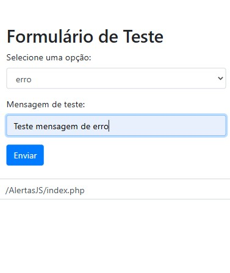
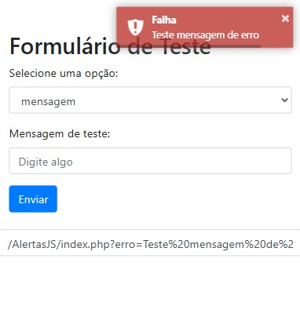

# api.alerts

Padrão de alerta para aplicativos ou sites web.

## Instruções de Uso

Adicione os seguintes links no `<head>` da sua página:

```html
<script src="assets/js/jquery-3.6.0.min.js"></script>
<link rel="stylesheet" href="assets/css/src/toastr/toastr.min.css">
<script src="https://cdnjs.cloudflare.com/ajax/libs/toastr.js/latest/toastr.min.js"></script>
```

## Como Chamar a Função

Inclua o código abaixo na sua página desejada, seguindo a mesma sequência:

```html
<!-- ========= Verifica Alerta =========  -->
<script src="assets/js/alerts.js"></script>
<?php include_once('alerts.php'); ?>
<!-- ========= Fim - Verifica Alerta =========  -->
```

Com isso, você poderá utilizar o sistema de alertas na sua aplicação.

Exemplo index.php:


